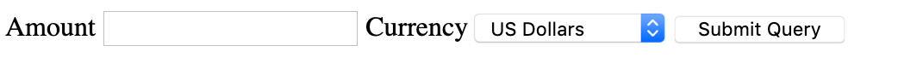

Forms Processing
================


Forms and HTTP Requests
-----------------------

Form processing is fundamental to any web application. Forms allow
user's to interact with an application by filling out data fields and
uploading files. The web application needs to be able to receive input
from the form and act on it. To do this, we need to understand how form
data is sent along with the HTTP request and how the server encodes it
and sends it to the application script in the WSGI environment.

```html
<html>
 <body>
   <h1>Form Page</h1>
   
   <form method=GET>
    <fieldset>
   <legend>SAMPLE FORM</legend>
   <ul>
    <li>First Name: <input name='first'></li>
    <li>Last Name:  <input name='last'></li>
   </ul>
   <input type='submit' value='Submit Form'>
   </fieldset>
   </form>
   
 </body>
</html>
     
```

The simple form above has two input fields called 'first' and 'last' and
a submit button. The method attribute of the form is 'GET' which is the
default and means that when the user clicks on "Submit Form", the
browser will send an HTTP GET request to the server with the form data
encoded in the URL. So, if the form above is served at the URL
http://localhost:8080/ then submitting the form will generate a request
to the URL http://localhost:8080/?first=Steve&last=Cassidy. The HTTP
request will look like:

```
GET /?first=Steve&last=Cassidy HTTP/1.1
Host: localhost:8080
Connection: keep-alive
User-Agent: Mozilla/5.0 (X11; Linux i686) AppleWebKit/535.11 (KHTML, like Gecko) Ubuntu/11.10 Chromium/17.0.963.56 Chrome/17.0.963.56 Safari/535.11
Accept: text/html,application/xhtml+xml,application/xml;q=0.9,*/*;q=0.8
Referer: http://localhost:8080/
Accept-Encoding: gzip,deflate,sdch
Accept-Language: en-GB,en-US;q=0.8,en;q=0.6
Accept-Charset: ISO-8859-1,utf-8;q=0.7,*;q=0.3
    
```

Note that the two form field names are encoded in the URL along with the
data that I entered and this is reflected in the GET line of the
request.

The other method for submitting forms is POST and I can easily modify
the above form by changing the method attribute of the form. If we use
the POST method then the browser will send a POST request to the server
with the form data encoded as part of the request body. Here's the
resulting HTTP request:

```
POST / HTTP/1.1
Host: localhost:8080
Connection: keep-alive
Content-Length: 24
Cache-Control: max-age=0
Origin: http://localhost:8080
User-Agent: Mozilla/5.0 (X11; Linux i686) AppleWebKit/535.11 (KHTML, like Gecko) Ubuntu/11.10 Chromium/17.0.963.56 Chrome/17.0.963.56 Safari/535.11
Content-Type: application/x-www-form-urlencoded
Accept: text/html,application/xhtml+xml,application/xml;q=0.9,*/*;q=0.8
Referer: http://localhost:8000/
Accept-Encoding: gzip,deflate,sdch
Accept-Language: en-GB,en-US;q=0.8,en;q=0.6
Accept-Charset: ISO-8859-1,utf-8;q=0.7,*;q=0.3

first=Steve&last=Cassidy    
    
```

Note that the form data appears just as it did in the GET request but
it's now part of the HTTP request body rather than being in the URL.

Recall from our discussion of HTTP requests that GET and POST have quite
different meanings in the HTTP protocol. The way that form data is
encoded in each reflects these differences.

GET requests are intended to be used to address distinct *resources* and
so all of the information that defines the resource is included in the
URL. The form data appended to the GET request is like a qualifier on
the resource name: for example, tell me the weather, but on this date
and in this location. The GET URL can be bookmarked or sent to someone
else.

On the other hand, a POST request is meant to reflect submission of data
to a web resource - either to create a new sub-resource or to update or
modify an existing one. In the POST request the form data is sent along
as the payload of the request. Unlike the GET request, the form data
isn't a qualifier on the resource being requested, it is data that we're
submitting. POST requests should be used for most form submissions since
most of the time, the form is collecting user data and submitting it to
the web application.


Dealing with Form Data in Bottle
--------------------------------

Bottle makes any form data submitted with the request available via the
`request` object. Each of the ways that form data might be sent are
handled automatically by Bottle, giving the programmer a simple
interface to read the data that has been sent.

Bottle uses a
[FormsDict](http://bottlepy.org/docs/dev/api.html#bottle.FormsDict) data
structure, to store data received in a request. FormsDict behaves a bit
like a regular Python dictionary and allows the programmer to access the
form fields that were sent like the entries in a dictionary. Different
kinds of form data are made available as different properties of the
`request` object. Any data sent as a GET request (in the query string)
is available as `request.query` while forms submitted via POST are
available as `request.forms`. In each case, the value of a form variable
`name` can be accessed as `request.query.get('name')` or
`request.forms.get('name')`.

Here is an example application that illustrates basic form submission
with Bottle. First we write a simple template that contains a form and a
space for a message:

```html
<html>
  <head>
      <title>Form Example</title>
  </head>
  <body>
    <form method="post" action="/">
        <fieldset>
            <legend>SAMPLE FORM</legend>
            <ul>
                <li>First Name: <input name='first'>
                </li>
                <li>Last Name: <input name='last'>
                </li>
            </ul><input type='submit' value='Submit Form'>
        </fieldset>
    </form>
    
    <p>{{message}}</p>

  </body>
</html>
   
```

Note that the action of the form is set to the root URL (/) and that the
method is POST, meaning that to handle the form we need to handle POST
requests to this URL. However, the first step is to serve the form to
the user so they can fill it out and submit it. Hence we write the
handler for the root URL to just serve the template with a fixed
message:

```python
from bottle import Bottle, template, request

app = Bottle()

@app.route('/')
def index():
    """Home Page"""
    
    return template("form.tpl", message="Please enter your name") 
   
```

The default route decorator in Bottle will only handle a GET request, so
the above code will be triggered whenever we get a GET request for the
root URL. Once we have served the page the user will fill out the form
with first and last names and click Submit. This will generate a POST
request to the root URL; we now need to write code to handle that
request:

```python
@app.route('/', method="POST")
def formhandler():
    """Handle the form submission"""
    
    first = request.forms.get('first')
    last = request.forms.get('last')
    
    message = "Hello " + first + " " + last + "."
    
    return template("form.tpl", message=message) 
   
```

When the POST request is received it will trigger this handler. The
function then retrieves the values of the two form fields from
`request.forms` and constructs a response using them.

Note that there is a shorthand version of
`@app.route('/', method="POST")` used above. I can write
`@app.post('/')` instead to indicate that this handler should only be
triggered for post requests.

### Handling Numerical Data

If you are handling numerical data from a form, for example you need
someone to submit their height in meters, you need to get a floating
point value back from the form rather than a string. To achieve this you
can supply a `type` keyword to the `request.forms.get` method:

```python
       height = request.forms.get('height', type=float)
```

The type keyword can be used for other simple types such as `int` and
`bool`.

### Validating Forms

In the example above, we get the values of the two form variables from
the request and use them to construct the output page. This assumes that
the request contains a valid form submission, but it could be the case
that values were not filled in in the form or someone is trying to
attack the application by faking form submissions. Our code should be
robust against these possibilities.

The most common thing to validate is that a required field has been
filled in by the user. In this case, for most form field types, the
request will contain a value for the field but the value will be empty.
The result is that we get an empty string when we call `get` for this
field. If we want to check whether the field 'first' has been filled in
we'd use the following code:

```python
    first = request.forms.get('first')
    last = request.forms.get('last')
    
    if first is "":
        message = "Please supply a value for the First field"
        return template("form.tpl", message=message)
   
```

An exception to this pattern is a radio button input type in a form. If
we present a radio button set that has no default selection, and the
user does not select anything, the request will not contain a value for
that field. In this case the call to `get` will return `None`.

The final case to check against is when someone is sending data to your
application without going through your HTML form. This could happen if
you are automatically testing your code or if someone has written a 'bot
to automate submissions. A robust web application will check for these
cases where to make sure that the input that we expect is actually
present.

To implement this check we can write a simple function that takes a list
of field names and a form and checks that the value is neither the empty
string or None for each required field. It will return a list of error
messages that could be inserted into the resulting error page:

```python
def validate_form(form, required):
    """Check that all fields in required are present
    in the form with a non-empty value.  Return
    Return a list of error messages, if there are no errors
    this will be the empty list """
    
    
    messages = []
    for field in required:
        
        value = form.get(field)
        if value is "" or value is None:
            messages.append("You must enter a value for %s in the form" % field)
            
    return messages
   
```

This could be used in our example as follows:

```python
@app.post('/')
def formhandler():
    """Handle the form submission"""
        
    first = request.forms.get('first')
    last = request.forms.get('last')
    
    errors = validate_form(request.forms, ['first', 'last'])
    
    if errors is []:
        message = "Hello " + first + " " + last + "."
    else:
        message = errors
    
    return template("form.tpl", message=message)
   
```

### Exercises

It is a good idea to get lots of practice with different kinds of forms
and data to work out the details of form data handling. You can set
yourself some challenges of simple forms sent to applications that do
some kind of calculation. Here are some examples:

1.  Write an application that presents a form to the user to enter their
    height (cm) and weight (kg), the application should compute the Body
    Mass Index (BMI) which is defined as the weight divided by the
    square of the height in metres. The input height and weight and the
    BMI should be included in the resulting page.
2.  Write a form based application that calculates a GPA (or
    similar statistic) given a list of grades in units. You can use a
    fixed number of units (say 5) so that generating the form is easier.
    For an extra challenge, make the entered grades persist in the form
    fields after you've submitted the form.
3.  Write a form based application that checks whether someone is old
    enough to vote based on their date of birth, input the DOB with
    selection box. You could just do this with a naive algorithm that
    subtracts the current year from the year of birth, but for an extra
    challenge look at [this discussion](http://stackoverflow.com/questions/2217488/age-from-birthdate-in-python)
    of calculating age from birthdate in Python.


### Another Example: Form using GET

Let's walk through another example application using forms, this time with
a form submitted via the GET method.  This is appropriate if the form
submission is really asking to retrieve a value given some input. In this
example we will submit an amount and a currency and get back the amount
converted to Australian Dollars (AUD).  

First I'll write a little function to do the conversion, it will be based
on a dictionary of currency conversion rates.  The currency will be
looked up and the amount multiplied by the relevant rate.  Here's the
function:

```python
def convert(amount, currency):
    """Convert an amount of some currency into AUD
    return AUD amount as a float
    """

    exchange_rates = {
        'USD': 1.41,
        'GBP': 1.88,
        'EUR': 1.60
    }

    if currency in exchange_rates:
        return amount * exchange_rates[currency]
    else:
        return 0.0
```

If the currency name is not recognised it will return zero.  

To make use of this in our application we need a form to allow the entry
of the amount and currency.  The amount will be a simple text input but 
the currency is one of a set of fixed values so we can use a select
input: 

```html
    <form method="GET" action="/convert">
        <label for="amount">Amount</label>
        <input type="text" name="amount">

        <label for="currency">Currency</label>
        <select name="currency">
            <option value="USD" selected>US Dollars</option>
            <option value="GBP">British Pounds</option>
            <option value="EUR">Euros</option>
        </select>

        <input type="submit">
    </form>
```

Note that we've marked one of the select options as `selected` so that it will
be the default option when the page loads. Here's what the form looks like:



To complete the page template we will add some code to display the result
of the conversion. We will use the same template to display the initial
page and the result of conversion so we need to display this fragment only
if we provide a value for one of the variables, for example `result`.

```html
    % if result:
    <h2>Result of Conversion</h2>
    <p>{{currency}} {{amount}} = AUD {{result}}</p>
    % end
```

Now let's being the application, we first need a handler for the root url to 
deliver a page containing the form.  We need to pass a value for `result` in to
the template with a value of `None` so that the if statement above will work.  Here's
the code:

```python
@app.route('/')
def index():
    """Home Page"""

    info = {
        'result': None
    }

    return template("form.tpl", info)

```

Note that we've stored the template code above in `form.tpl` in the views directory.

This application will deliver a page containing the form. When the user enters an amount
and selects a currency then clicks the Submit button, the browser will send a GET request
to the URL `/convert` with the form values appended to the URL.  Eg. 

```html
http://127.0.0.1:8080/convert?amount=12.4&currency=USD
```

If we do this now we'll get an error (404) because we've not written any code to handle the
request for this URL.  So, we now need to add a handler for GET requests to`/convert`.  This
handler needs to get the two form values and then call the `convert` function above.  
Having done this we can use the `template` function to pass these values into the page
template and generate the response.  Here's the code:

```python
@app.route('/convert')
def convert_view():
    """Process form data and return page with
    result"""

    amount = request.query.get('amount', type=float)
    currency = request.query.get('currency')

    info = {
        'amount': amount,
        'currency': currency,
        'result': convert(amount, currency)
    }

    return template('form.tpl', info)
```

Things to note here.  We use `request.query.get` to access the form data (for the POST request
earlier we used `request.forms.get`).  For the `amount` field we provide a `type` argument
to ensure that the value we get back is a float rather than a string.  Having pulled the two
form field values from the request we create a dictionary containing the form data and the
result of the conversion; these three values are required for the template.   We then pass
the `info` dictionary into the template function.  

This completes the example. We have two route handlers, one generates the original page
containing the form, the second processes the form data and generates a page containing 
the form and a result.  

One final modification would be to do some error handling.  The code above will crash if there is
no value for one of the form variables - so if the user does not fill out a value for `amount`
and clicks Submit, the app will crash and return a 500 Server Error response.  Similarly,
if the value of `amount` is not a valid number, we'll get an error.  To deal with either
of these situations we can use the `default` argument to `request.query.get`.  This provides
a default if the value is not provided or if it can't be converted to a float.  Here is the 
modified code:

```python
@app.route('/convert')
def convert_view():
    """Process form data and return page with
    result"""

    amount = request.query.get('amount', type=float, default=0.0)
    currency = request.query.get('currency', default='USD')

    info = {
        'amount': amount,
        'currency': currency,
        'result': convert(amount, currency)
    }

    return template('form.tpl', info)
```

This version is a little more robust and will always return an answer.  We could do better
by notifying the user that they should really fill out a value for `amount`, but we'll leave
that as an exercise for the reader just now.

