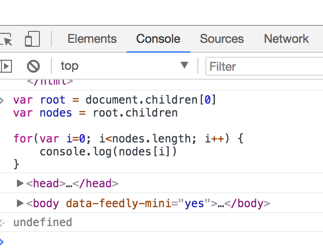

# The Document Object Model

Javascript running in the web browser has access to the currently
displayed web page via an interface called the Document Object Model or
DOM. The DOM interface is object based as it's name suggests and allows
a script to locate any part of the page, read the contents and update it
either by changing text or adding or removing elements in the page.

The DOM is the way that the browser represents the page being viewed. It is
an interpretation of the HTML structure as a hierarchical tree of objects. The
main objects in the tree represent the elements in the HTML page, other nodes
represent attributes and the textual content of the elements.  Here is a simple
example taken from the W3C
([What is the Document Object Model](https://www.w3.org/TR/WD-DOM/introduction.html))
corresponding to the following HTML fragment:

```html
<table>
  <tbody> 
    <tr> 
      <td>Shady Grove</td>
      <td>Aeolian</td> 
    </tr> 
    <tr>
      <td>Over the River, Charlie</td>        
      <td>Dorian</td> 
    </tr> 
  </tbody>
</table>
```


Note that the element nodes are arranged in a tree structure, the `table`
element contains one `tbody` and that contains two `tr` nodes.  We talk about
these as the _children_ of the _parent_ nodes. `table` has one child
and `tbody` has two.  The rounded nodes are those containing the text inside
the elements; these are the leaves of the tree.

In Javascript, we have a standard interface to the DOM that is implemented
by all browsers and can be used to both _read_ the contents of the
current page and _update_ the page with new or modified content.

In a Javascript program running in the browser, the current document object
can be accessed by the global variable `document` which is an instance of
the class `Document`.  This is the root of
the tree and all operations on the DOM are carried out via method calls
on `document`.

This chapter will not provide an exhaustive tutorial on the DOM. You should
look at other resources for that, for example the
[MDN Tutorials on Manipulating Documents](https://developer.mozilla.org/en-US/docs/Learn/JavaScript/Client-side_web_APIs/Manipulating_documents)
or the [W3Schools HTML DOM tutorial](http://www.w3schools.com/htmldom/)
Instead, this chapter will point out some of the main concepts relating
to our use of the DOM in building web applications.

## Finding parts of the page

There are two main ways to locate elements in the DOM from Javascript: you
can navigate from the root `document` step by step via child links to
find the element you want or you can use methods to search the tree for
the element.  This second option is much more useful and more commonly used.

To find the children of the `document` node we can use the property `document.children`
which is a list of child nodes.  In the case of the `document` node there should
be one child which is the root of the document - the `<html></html>` element.  This
element can have more children - typically it will have `head` and `body` elements
below it.  The following code will show these children:

```javascript
let root = document.children[0]
let nodes = root.children

for(let i=0; i<nodes.length; i++) {
    console.log(nodes[i])
}
```

Note that you can try these examples out in your web browser. Open the developer
tools and select the Javascript Console.  You can enter these commands at the prompt
to explore the DOM representation of the page that is loaded in your browser.  If you
print an element with `console.log` you will get a representation of the content
of the element that you can explore as a DOM tree.



A more common operation is to search for the element you are interested in using
either the element name, class or identifier (id).  The `document` object has
methods for each of these options illustrated in the following example:

```javascript
// get all of the h1 elements in the document
let headers = document.getElementsByTagName("h1")

// get all of the elements with class='important'
let important = document.getElementsByClassName('important')

// get the element with id='content'
let content = document.getElementById('content')
```

These methods return either an array-like object (the first two `getElementsBy` methods)
or a single node (the last one `getElementBy`).  Each of these nodes has a similar
set of methods to the `document` object (they are instances of `Node` rather
than `Document` but
provide a similar interface). So, you can look at their children
or even search within the element for other elements. In this example we
find an element with a particular id and then search within that for
all of the table data (td) elements:

```javascript
let table = document.getElementById('result-table')
let tdlist = table.getElementByTagName('td')
for (let i=0; i<tdlist.length; i++) {
    console.log(tdlist[i].innerHTML)
}
```

This example also shows another part of the node interface. I can find the
content of a node as an HTML string via the `innerHTML` property.  This is a
very useful
property because it also allows us to update the content of the element
to modify the page as we'll see in the next section.  Another similar property
is `innerText` which is the content of the element as text, with any HTML tags
removed.  

An alternate interface for finding elements is `querySelector`. This
allows you to use CSS style element selectors to identify your target
elements.  There are two methods: `querySelector` returns the first
matched element while `querySelectorAll` returns all of them.

```javascript
// in this example, the first  elements inside the element with id="main"
let image = document.querySelector('#main img');

// and here, get all of the images inside "main"
let images = document.querySelectorAll('#main img');
```

## Modifying the Page

As mentioned, the `innerHTML` property of a node in the DOM corresponds to
the HTML content of an element as a string.  This is most useful when we
want to change the content of the element from our script.  This is just
one way that we can modify the current page from Javascript.  A common
practice in Javascript driven web applications is to provide a placeholder
in a page with a given id attribute that will be filled with different
content from the script as it executes.  So I might have a target
`div` element like this:

```html
<div id="content"></div>
```

and target this from my Javascript:

```javascript
let contentDiv = document.getElementById('content')
let newContent = "<p>Demonstrating insertion of content.</p>"

contentDiv.innerHTML = newContent
```

There are other methods of modifying the content of an element, for example,
the following code will create a new paragraph tag and add some text content
to it, then insert it inside the content div selected above.

```javascript
let newP = document.createElement('p')
newP.innerText = "Another example of inserting content"
contentDiv.appendChild(newP)
```

These examples illustrate the way in which Javascript can update the
current page being shown in the browser. Any changes that are made
to the `document` are reflected live in the page.  This is the basis of
our ability to write Javascript applications with rich user interfaces
running inside the web browser.

## Other Parts of the DOM API

There are many other things that can be done via the DOM; in fact, most of
what we will discus in these chapters on Javascript is about the DOM.
For example, when we look at [event handlers](events.md) we will learn about
the event handler interface linked to DOM nodes and the `addEventListener`
function that interacts with it.  Form elements make up a subset of the
collection of HTML elements and have particular interfaces to handle user
interaction etc.

We use the DOM to interact with the HTML page and hence the user.  It is
the basic building block of client side web application programming.

## Exercise: Fake News

This exercise is about modifying the content of a page in your web browser using
Javascript.  As we have said, Javascript has access to the current page via the
Document
Object Model or DOM.  In your browser, the variable document represents
the current document
and your code can use it to read and write to the current page.  In this
exercise we will
use the developer tools Javascript console to write Javascript to access
parts of the main
page of a newspaper site and, just for fun, modify their contents.
The instructions here
relate to Chrome but some variation will work in any browser.

* Go to the main page of a news website, eg. SMH, Guardian, Telegraph, Buzzfeed
or whatever (it should have headlines on the main page)
* Right click on one of the headlines and choose "Inspect"

This should show you the HTML of the page with the element corresponding
to your headline highlighted. Take note of the kind of element it is
(eg. `<h3>`) and any class attributes it has. You will use these to select
this element in your Javascript code.

Switch to the Console tab in developer tools
The console allows you to run Javascript code in the context of the current page,
so the document variable will represent the page you are viewing.  Write Javascript
code to select all of the headline elements, so if you saw that they were all `<h3>`
elements you might write:

```javascript
headlines = document.getElementsByTagName("h3")
```

Take the first of these and find the HTML content of the heading:

```javascript
headlines[0].innerHTML
```

Now modify this to add your own message to the page

```javascript
headlines[0].innerHTML = "COMP249 Found to be Best Unit in the Universe!"
```

Check the page to see your updated headline.

Ok, so we can fake the news, that's good but we can go further.  

1. Write a for loop that changes the content of all of the headlines to
your chosen message
2. Write a function that takes your new message as an argument and modifies
the headlines when it is called
