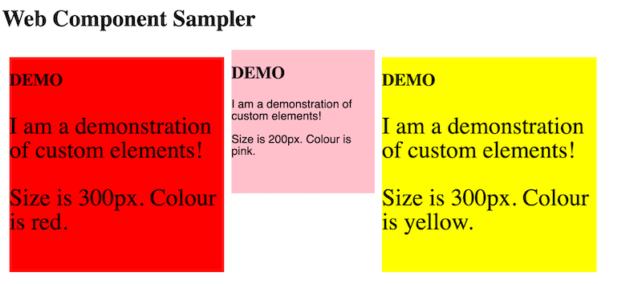

# Web Components

[Web Components](https://developer.mozilla.org/en-US/docs/Web/Web_Components) are
a part of the HTML standard that allows the front-end developer to build
component-based web applications.

Component based application development has become very popular with tool-kits
like React, Angular and Vue.   The idea is that we break down the appearance
and functionality of our web application into components that can be
developed and tested more or less in isolation. A component might be the banner
heading on your page, a table to display data, a form to interact with the user,
or a card to display product information. You write each of these as
components and then put them together to create your whole application.

Web Components provides a way to do this using core web technologies rather than
third-party tools.  The capability is built into every modern browser, so you can
just write Javascript code linked to an HTML page to make use of it.  The idea
actually makes use of three separate standards:

* Custom elements - the ability to define a new HTML element like `<card-display>` and
 associate Javascript code with it to be run when the element is used in a document.
* Shadow DOM - the ability to have a separate DOM representation behind a
 custom element so that the HTML and CSS used by that element don't interfere with
 the main page.
* HTML Templates - a built in template mechanism to make building re-usable HTML
 structures easier.

## Custom Elements

The HTML standard allows us to use any element name in a page, even if it isn't
defined in the standard.   So I can invent a new element `<spot></spot>` and use it
in my document. The browser will not know what to do with it so will effectively
treat it like `<span></span>` - it will not affect the page layout at all but will
appear in the DOM.   I can attach a CSS style rule to this new element and the browser
will render it just like it was a 'real' element:

```HTML
<spot style="color: blue; background-color: yellow;">Out Damn Spot!</spot>
```

In the HTML standard, an unknown element like this is interpreted as [HTMLUnkownElement](https://html.spec.whatwg.org/multipage/dom.html#htmlunknownelement) which means
that while it is allowed, it doesn't have the same DOM interface as a real element 
(HTMLElement).    However, a special type of unknown element is treated differently,
that is those that have a [valid custom element name](https://html.spec.whatwg.org/multipage/custom-elements.html#valid-custom-element-name); that is, one containing
a hyphen (dash) character like `<my-spot>`, `<info-card>` or `<login-form>`.  These
elements are treated as valid elements and the custom element standard means that
we can define the behaviour of these new elements with Javascript as well as their appearance with CSS.

Here's an example of a custom element with some style defined, at this point it
is just like the `<spot>` element above.

```HTML
<!DOCTYPE html>
<html>
    <head>
        <title>Web Components Sampler</title> 
        <style type="text/css">
            demo-component {
                display: block;
                background-color: red;
                width: 200px;
                height: 200px;
            }
        </style>
        <script src="script.js" defer></script>
    </head>
    <body>
        <h1>Web Component Sampler</h1>
        <demo-component>
            <p>Hello World</p>
        </demo-component>
    </body>
</html>
```

### Adding Javascript

The new element `<demo-component>` just acts as a wrapper around the paragraph
content and will appear as a 200 pixel red square.  The next part of defining a
custom element is to attach some Javascript code that will be run at different
points in the life-cycle of the element.  This is done in the `script.js` file
by defining a new class that extends the built-in `HTMLElement` class.  Here is 
a simple example.

```Javascript
class DemoComponent extends HTMLElement {

    connectedCallback () {
        this.innerHTML = `
        <h2>DEMO</h2>
        <p class="demo">I am a demonstration of custom elements!</p>`;
        console.log('rendered', this);
    }
}

customElements.define('demo-component', DemoComponent);
```

The class `DemoComponent` defines one method `connectedCallback` which is
code that will be called whenever this element is inserted into the DOM - that is
when an HTML file containing your element is parsed or some Javascript code
inserts the element into an existing DOM.   In my example above, I modify
the innerHTML of the element to have some new content which will replace
the 'Hello World' paragraph that was already there.  I used a Javascript
string template to do this (note the backticks `\`` rather than single quote
around the string) since these can be multi-lined and later will allow 
inserting variables into the content.

The `console.log` line will output to the browser console when this code
is called. When you run this code, check the console and inspect
the element that is printed out.

The last line of Javascript is critical as this is where we associate the
`DemoComponent` class with the `<demo-component>` element.   The names
are similar by convention but we are just attaching a class to an
element name.  Note that the element name must start with a lower case letter and 
consist of lower case letters including unicode characters, numbers, '.' or '_' and must contain one '-' character.  This means you can have special characters like `<math-α>`
or `<emotion-😍>` but not eg. `<Capital-x>` or `<spot>` ([Reference](https://html.spec.whatwg.org/multipage/custom-elements.html#valid-custom-element-name)).

### Adding Style

In my example, the CSS style associated with the new element is contained in
the main page. It would be better to have the layout of the new component be
defined within the Javscript code to make it more modular and stand-alone. 
We know that we can modify the style of any HTML element from Javascript
so we just do that now in this next version:

```Javascript
class DemoComponent extends HTMLElement {
    connectedCallback () {
        console.log('rendered', this);
        this.innerHTML = `
        <h2>DEMO</h2>
        <p class="demo">I am a demonstration of custom elements!</p>`;
        this.style = `
            display: block;
            background-color: red;
            width: 200px;
            height: 200px;
        `
    }
}
```

Now the `<style>` block in the main page is not needed. When the new element is
created we can insert the style directly into the element and our implementation
is now self contained.

Note that this way of adding style is different to the stylesheet rule that we had
before in that it only applies to this instance of `<demo-component>` rather than
all of these elements in the page.

### Element Properties

So far, the custom element will be the same every time it is used. It would be more
useful to be able to control aspects of the element when it is created. We can
do this using element attributes.  Let's build a version of the new element
where we can optionally control the size and colour of the square via an
input attribute.  In use it will look like this:

```HTML
    <body>
        <h1>Web Component Sampler</h1>
        <demo-component size="300px"></demo-component>
        <demo-component size="120px" color="pink"></demo-component>
    </body>
```

 (I'm using the US spelling of colour for consistency with other CSS attribute
 names).  To implement this we need to access the attributes of the element
 and use them when we generate the element style in the `connectedCallback`.  The
 first thing though is to introduce the *constructor* of the class which will
 be called when the element is created.   In the constructor we will save
 the values from the attributes, setting defaults if they are not present.

In the `connectedCallback` we use the values of the `size` and `color`
attributes to insert into the CSS string value that we use to update
the element style attribute.    We can also insert these values into the
innerHTML content:

```Javascript
class DemoComponent extends HTMLElement {

    constructor () {
        super();
        this.size = this.getAttribute('size') || '200px';
        this.color = this.getAttribute('color') || 'red';
        console.log('constructed', this.size, this.color);
    }

    connectedCallback () {
        console.log('rendered', this);
        this.innerHTML = `
        <h2>DEMO</h2>
        <p class="demo">I am a demonstration of custom elements!</p>
        <p>Size is ${this.size}. Colour is ${this.color}.`;
        this.style = `
            display: block;
            background-color: ${this.color};
            width: ${this.size};
            height: ${this.size};
        `
    }
}

customElements.define('demo-component', DemoComponent);
```

In the constructor, we first call the `super()` function - this ensures
that the constructor of the parent class (`HTMLElement`) is called (this has
to be done explicitly in Javascript).  We then use an or-expression
to store either the value of the attributes or the default if that is not set.

## Shadow DOM

The purpose of the [Shadow DOM](https://developer.mozilla.org/en-US/docs/Web/Web_Components/Using_shadow_DOM) is to provide *encapsulation* - isolating the
internal workings of our custom element from the rest of the DOM structure.  In
the first example of why this is an advantage we'll show how it 'protects' the
internal parts of our element from global stylesheets.

Here's the example custom element modified to use the shadow DOM:

```Javascript
class ShadowDemoComponent extends HTMLElement {

    constructor () {
        super();
        this.size = this.getAttribute('size') || '200px';
        this.color = this.getAttribute('color') || 'red';
        this.attachShadow({ mode: 'open'});
        console.log('constructed', this.size, this.color);
    }

    connectedCallback () {
        console.log('rendered', this);
        const wrapper = document.createElement('div');
        wrapper.innerHTML = `
        <h2>DEMO</h2>
        <p class="demo">I am a demonstration of custom elements!</p>
        <p>Size is ${this.size}. Colour is ${this.color}.`;
  
        const style = document.createElement('style');
        style.textContent = `
        :host {
            display: block;
            background-color: ${this.color};
            width: ${this.size};
            height: ${this.size};
        }
        p {
            font-family: sans-serif;
        }
        `
        this.shadowRoot.append(style, wrapper);
    }
}

customElements.define('demo-shadow', ShadowDemoComponent);
```

In the constructor, we call `this.attachShadow` to attach a new shadow DOM
to this new element.  We use `{mode: 'open'}` which will allow the internals
to be accessed from outside Javascript code (`{mode: 'closed'}` would block this).

In the `connectedCallback`, instead of modifying the innerHTML of the custom
element we create a new wrapper element (a `<div>`) and insert the content
into that.  While setting the style attribute of the custom element would
still work, we take a different approach here and create a `<style>` element
and set the text content to a mini-stylesheet for our new element.  The
`:host` selector in the stylesheet refers to the host element of the shadow
DOM - our custom element.

The stylesheet rule for paragraphs in the custom element will only apply to 
paragraphs within the shadow DOM, not to any paragraphs in the outside document.
In addition, any rules for paragraphs in the main document won't apply inside
the shadow DOM.  If we modify the main HTML page as follows to provide 
a global paragraph style, it will apply to the original `<demo-component>` 
element but not to our new shadow DOM version.

```HTML
<!DOCTYPE html>
<html>
    <head>
        <title>Web Components Sampler</title> 
        <script src="script.js" defer></script>
        <style type="text/css">
            .container {
                display: flex;
            }
            demo-component {
                margin: 10px;
            }
            p {
                font-size: 25pt;
            }
        </style>
    </head>
    <body>
        <h1>Web Component Sampler</h1>
        <div class="container">
            <demo-component size="300px"></demo-component>
            <demo-shadow size="200px" color="pink"></demo-shadow>
            <demo-component size="300px" color="yellow"></demo-component>
        </div>
    </body>
</html>
```

Here's a screenshot of the result:

.

The two original components contain paragraphs that are affected by the global
style rule.  The shadow component is not and the local paragraph rule applies
to change the font family.

So, the shadow DOM provides an enhanced level of encapsulation to our custom
element which will insulate it from changes to the global stylesheet and potentially
protect it from being modified by global Javascript (if it is declared closed).

## Templates

