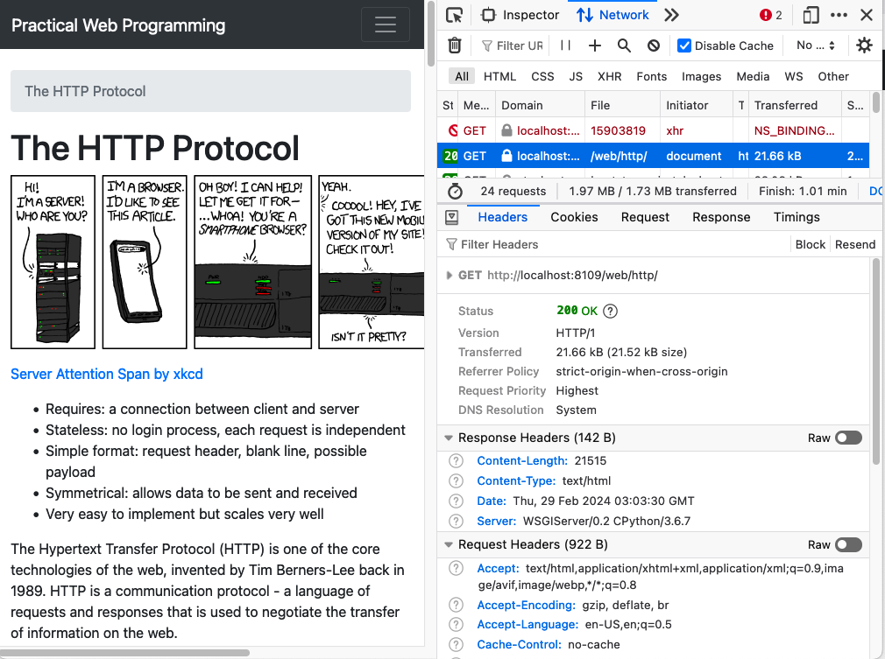

# The HTTP Protocol


[Server Attention Span by xkcd](http://xkcd.com/869/)

- Requires: a connection between client and server
- Stateless: no login process, each request is independent
- Simple format: request header, blank line, possible payload
- Symmetrical: allows data to be sent and received
- Very easy to implement but scales very well

The Hypertext Transfer Protocol (HTTP) is one of the core technologies
of the web, invented by Tim Berners-Lee back in 1989. HTTP is a communication
protocol - a language of requests and responses that is used to negotiate
the transfer of information on the web. 

The web is driven by _requests_ that are sent by _clients_ to a _server_.
A client is usually a web browser but it could be a script, for example,
a search engine's web crawler.  When the server gets a request, it works
out how to answer it and sends in return a _response_.  The HTTP protocol
defines how these requests and responses look and the way that client and
server talk to each other.

The first thing that is required to make an HTTP request is a point-to-point
connection between client and server.  This is established on the internet
via the TCP/IP protocol.  Once in place, the client is able to send messages
to the server and wait for a response.  

In this chapter, we'll talk mainly about the older but still widely used
1.1 version of the HTTP protocol.
The newer HTTP/2 and HTTP/3 protocols follow the same basic ideas but
are more complicated in the way that they exchange messages. The final section
will provide a summary.

## The HTTP Request

The message that is sent in an HTTP request begins with a textual _header_.
The first word in the request is always an _HTTP Verb_ that defines what
kind of request is being made.  We'll begin by looking at the most common
verb which is __GET__.    A GET request asks for a particular resource to
be sent back in the response.  Following the word __GET__, the name of the
resource to be returned is sent, this is the path part of the URL.  Finally,
the first line ends with the version of the HTTP protocol that is being used
by the client.  Here are some first lines for the URLs `http://example.org/`

```HTTP
GET / HTTP/1.1
```

`http://example.org/style.css`

```HTTP
GET /style.css HTTP/1.1
```

`https://pwp.stevecassidy.net/web/http/`

```HTTP
GET /web/http/ HTTP/1.1
```

Note how the path part of the URL (after the domain name, starting with the
first `/` character), becomes the second word in the GET request.

The first line of the request is then followed by one or more _header lines_ that
contain additional information about the request. Here's a real example from
the URL `https://pwp.stevecassidy.net/web/http/`

```HTTP
GET /web/http/ HTTP/1.1
Host: pwp.stevecassidy.net
User-Agent: Mozilla/5.0 (Macintosh; Intel Mac OS X 10.15; rv:123.0) Gecko/20100101 Firefox/123.0
Accept: text/html,application/xhtml+xml,application/xml;q=0.9,image/avif,image/webp,*/*;q=0.8
Accept-Language: en-US,en;q=0.5
Accept-Encoding: gzip, deflate, br
Referer: https://pwp.stevecassidy.net/
Connection: keep-alive
Upgrade-Insecure-Requests: 1
Sec-Fetch-Dest: document
Sec-Fetch-Mode: navigate
Sec-Fetch-Site: same-origin
Sec-Fetch-User: ?1
Pragma: no-cache
Cache-Control: no-cache
     
```

What do each of these headers mean? Which are required? Many are defined
in the official [HTTP Documentation](https://httpwg.org/specs/) maintained
by the HTTP Working Group, but
others can be defined via the HTTP extension framework.

To look at some examples.  The `Host` header encodes the host part of the original
URL. This is sent along with the request because one web server might be serving
pages for many websites.   The Host header is used to work out which response to
return.  

The `User-Agent` header includes details of your web browser.  This used to be
quite important when different web browsers had different capabilities.  These days
it is much less useful as most browsers implement the same set of web standards.
However, it can be used by the server to return different results to different browsers.

The `Accept` header tells the server a little about what kind of response the browser
can deal with. It can be used by the server to decide what kind of document to return.
In this case the browser says it prefers images in `avif` or `webp` format but note
the `*/*` at the end which means it will take anything.   The server can use this
information to return particular formats of images if it has them.

The header ends with a blank line and in this case, that is the end of the
request. For some requests, there can be more data sent after the header.
For example, when we are uploading a file or sending form data.  These
requests would not be GET requests but would use `POST` or `PUT`. We'll
look at these later.

Most of the header lines are optional. The simplest valid request would be, eg:

```HTTP
GET /web/http/ HTTP/1.1
Host: pwp.stevecassidy.net

```

__Note__ - the newer HTTP/2 and HTTP/3 protocols require a little bit more
setup so that the client knows that the server understands this more recent
protocol.   Lower level protocols are used when setting up the connection
to allow the server to tell the client that it understands
[HTTP/2](https://httpwg.org/specs/rfc9113.html#starting)
or [HTTP/3](https://httpwg.org/specs/rfc9114.html#connection-setup). In contrast,
HTTP/1.1 is assumed for any web server without prior acknowledgement.

## The HTTP Response

The web server receives the request and must decide how to handle it. In the simplest
case, it will locate a file that corresponds to the resource being requested and
will return that.  The message sent as the HTTP _response_ again begins with a header
that starts with a status line.  The status line begins with the version
of HTTP being used and ends with a status code and message.  If the request
was successful, the most common status code is `200 OK`. Here is an example:

```HTTP
HTTP/1.1 200 OK
Server: nginx/1.18.0 (Ubuntu)
Date: Thu, 29 Feb 2024 02:46:24 GMT
Content-Type: text/html
Last-Modified: Wed, 21 Feb 2024 10:17:10 GMT
Transfer-Encoding: chunked
Connection: keep-alive
ETag: W/"65d5cda6-4e39"
Content-Encoding: gzip
     
```

As with the request headers, there are more lines following the first and the whole
header is terminated with a blank line.  In this case the header is saying that the
`Content-Type` of the returned document is `text/html`, telling the browser that
this is an HTML page rather than, say, an image.   The response will also be
sent back using a gzip encoding, meaning that it has been compressed by the
server to save network bandwidth.   If you look at the request header above,
you'll see that the browser indicated it could accept gzip responses, so the
server has used this capability to save resources.

In a response, we expect there to be something returned - in this case an HTML file.
The response payload is sent after the blank line that terminates the header.  
If we were to look at the response in this case we'd just see binary data
representing the gzip compressed HTML file.

## Viewing HTTP Requests and Responses

Your browser provides tools to help developers see the requests and responses that
it is sending.  It can be very useful to be able to see these as developers so you
should learn to use your browser tools.  Viewing requests and responses can be
useful in debugging your web application.

In most browsers, you can open the developer tools using the F12 key.  Note that
in Safari, you need to first 
[enable them in the settings](https://developer.apple.com/documentation/safari-developer-tools).

Here's an example of viewing the Network tab in the developer tools in Firefox
for this page.



In the Network tab you will see a list of all of the requests that are being sent
to render your page. Clicking on one of the requests will show the details of
that request and the response that was received.  Get used to using this tool
to view requests and responses and explore what is happening behind the scenes
in your browser.

## GET Requests are Idempotent

`GET` is the simplest and most common HTTP request. It is intended to be a simple
request for a resource and has the important property of being _idempotent_. This
means that responding to the request has no side-effects and could be carried out
many times without a problem.   That should be the case for any GET request but will
not be true for other requests as we'll now see.

## POST Requests

The next most common kind of request is a `POST` request.  Rather than just requesting
a resource from the server, a POST request sends some data to the server to update
a resource or carry out an action.  POST requests are generally used to submit
form data to a server and the request will generally be passed to a program/script
on the server to do what has been asked.   A POST request is not _idempotent_ because
it can affect the state of the world; for example, creating a new listing on Ebay
or transferring money between bank accounts.

A POST request has the same general form as a GET request. The main difference
is that it will have a _payload_ - content that will be sent along with the
request.   The payload can be as simple as the values of some form variables
or it could be a file to be uploaded to the server.  

As with the GET request, the POST request has headers that are terminated with
a blank line.  The POST body then follows that blank line.  Here is an example
request that submits some form data:

```HTTP
POST /process HTTP/1.1
Host: example.org
User-Agent: Mozilla/5.0 (Macintosh; Intel Mac OS X 10.15; rv:123.0) Gecko/20100101 Firefox/123.0
Accept: text/html,application/xhtml+xml,application/xml;q=0.9,image/avif,image/webp,*/*;q=0.8
Accept-Language: en-US,en;q=0.5
Accept-Encoding: gzip, deflate, br
Content-Type: application/x-www-form-urlencoded
Content-Length: 60
Origin: http://example.org
Connection: keep-alive
Referer: http://example.org/
Pragma: no-cache
Cache-Control: no-cache

name=Steve+Cassidy&age=33&message=This+is+my+message+to+you.
```

The first line follows the same pattern as the GET request with the action verb,
POST, followed by the resource name `/process` and the version of HTTP. The
following headers are also similar, with the addition of the `Content-Type` 
and `Content-Length` headers which relate to the content that is being sent
along with the request.  In this case we're sending 60 characters encoded in
the `x-www-form-urlencoded` format.  

You can see the content of the request in the last line above. It encodes three
form variables: `name`, `age` and `message`.  These are separated by the `&`
character and any spaces in the values are replaced with `+`.  This is a simple
form of encoding text and as its name suggests, is the one used to encode
data in a URL - for example if the resource you are requesting has spaces in it,
they would be replaced by `+`.

Once the server gets this request it will do whatever it decides is the right thing
to do and then return a response to us.  That will often be a new HTML page, so
the response could look just like the one we got from the GET request.   The effect
of the request though might be more involved since the server is probably adding
something to a database or creating a new resource in response to this request.

## GET Requests with Form Data

In the examples above we said that a `GET` request was for a simple
resource and a `POST` request is often for submitting a form.  However, it is
possible to send form data along with a `GET` request. Here we'll discuss how
this is done and then how you might decide whether to use a `GET` or `POST`
request for your form.

In an [HTML form](html.md#html-forms) the _method_ attribute defines what
HTTP request type will be used to send the form.  If this is `POST` then the
data will be URL encoded and sent in the request body as in the example
above.  If the method is `GET`, the form data is again URL encoded but this
time it is appended to the URL defined in the _action_ attribute. 

Assuming that the following form is included in the page at `http://example.org/`, 
when the submit button is clicked a `GET` request will be generated.

```HTML
<form method="GET" action="/search">
    <input name="q">
    <input type="submit" value="Submit Message">
</form>
```

The `GET` request will be sent to `http://example.org/search` - the URL is
derived from the source page URL with the form action URL appended. The
request will look something like:

```HTTP
GET /search?q=HTTP+Requests HTTP/1.1
Host: example.org

```

As you can see, the form data has been appended to the URL after a question
mark `?`. This whole request is then sent to the server which can respond
as it sees fit.  In this example, we seem to be sending a search term and
so the response may be a list of documents matching that search.

Going back to the definition of the `GET` request we said that it should be
_idempotent_ - it should not change the state of the world.   That would seem
to be the case here; we are returned a list of the documents matching the search
term and that would probably be the same whoever made the request.

However, it would be possible to send a `GET` request with our new message
in the `POST` example above:

```HTTP
GET /process?name=Steve+Cassidy&age=33&message=This+is+my+message+to+you. HTTP/1.1
Host: example.org

```

If the effect of this request is to create a new message and send it to someone,
that would not be an idempotent operation. Sending the request again would
send a new message.   So, even though we could use a `GET` request here, we
should not because it violates the meaning of `GET`.  Some parts of the
web infrastructure such as [caching](#http-caches) rely on proper use of
the request types.

### Is GET more Secure?

In a `GET` request including form data, the data is shown in the URL.  If the web
server is keeping a log of requests, the data will be included in the log
along with the IP address of the client machine.   If a `POST` request
was used instead, the form data would be part of the request body and would
not appear in any logs.  

In both cases, the same form data is included in the HTTP request being sent. If
someone was able to snoop on the request, they could see the data either way.

The only case where `POST` might be considered more secure is if the web logs
on the server are compromised.  In this case however, it is likely that the
databases on the server are compromised too and the attacker will have all
the access they need to the data.

Ultimately, neither type of request is more secure.

## Other Request Types

There are other kinds of request but all follow the pattern described above.

A `HEAD` request is like `GET` but the response will only contain the
headers rather than any body content.  It is used for checking whether
a resource has been updated since it was last retrieved or for trying
out (pre-flight) a request before sending it.  The client will look at
the response headers to work out what it should do next.

A `PUT` request can be used to upload a new resource and, like `POST`, will
have a payload.   The difference between `PUT` and `POST` is subtle and relates
to the resource name that the request is sent to.  As an example, if my web
application stores a collection of books they might be represented by the
URL `http://example.org/books/`. Sending a `GET` request to that URL would
return a page listing all of the books.  Sending a `POST` request might add
a new book to the collection. One particular book might be given the URL
`http://example.org/books/a_tale_of_two_cities.html`; I could send a `PUT`
request to that URL to upload a new version of the book.  

The final common request type is `DELETE`.  I might send a `DELETE` request
to the book URL to remove that book from the collection.

A web server won't automatically know how to respond to `POST`, `PUT` or `DELETE`
requests. The author of the server would need to write code to handle those
requests and do the right thing - adding or removing things from a database.
A `GET` request is much simpler and the default might be to just return the
contents of a file, however, the author of the server could also write code
to respond to GET requests as they see fit.

Request like `PUT` and `DELETE` are often protected by authentication requirements.
You might not be allowed to delete something unless you have admin permissions
on the site.  The HTTP request can include information about your identity
and authorisation.  See the [Authentication chapter](../advanced/authentication.md)
for more details and some examples.

## HTTP Response Codes

In the above examples we saw a response code of 200 which means that the request
succeeded.   There are a different
[HTTP status codes](http://en.wikipedia.org/wiki/List_of_HTTP_status_codes)
that can be returned by the server in different situations.

Response codes starting with 2 are success codes; the request was a success
and whatever you asked to be done was done. The most common is the 200 OK
response code but there is also 201 Created, used when a new resource
was created, or 204 No Content, meaning that everything was ok but the
server has no content to return to the client.

If the response code starts with 3, then the server is saying that the
client should look elsewhere for the resource they are asking for.
A 301 response means _Moved Permanently_ and the response headers
will include a `Location` header containing a new URL that the client
should request instead.  Your browser would automatically follow this
new URL and show you the page.   A 303 response is similar but means
that the resource has moved temporarily.  The only difference is that
the browser might remember the redirect for a 301 response and not go
there next time, whereas for 303 it would try the same request again.

A response starting with 4 is an error response indicating that the
client did something wrong.  The most common is the 404 Not Found response
meaning that the resource being requested is not present on the server.
There is also 403 Forbidden, meaning you aren't allowed to see that
resource and 402 Payment Required, meaning you need to organise payment
somehow.  A 405 response means you aren't allowed to use this HTTP
request method on this resource (eg. you can `GET` but you can't `POST`).

A 5xx response means that something went wrong with the server.  The most
common one we see is 500 which means _Internal Server Error_ - or the
server crashed.  You might also see 502 _Bad Gateway_ meaning that
the server is forwarding requests to another server and it didn't
get a useable response.

All of these response codes give us information about the response
that we get from the server and allow the client to act appropriately.

## HTTP Caches

A cache is a bit of software that watches HTTP requests and decides whether to send
them or just return the response that it got last time.  Your browser does this but
we can also set up a cache on the internet between the client and server; for example,
the University could have a cache that intercepts all traffic going out of its
network.   If the cache can respond with a saved page to some requests then it would
save time and network bandwidth.   However, the cache needs to be careful as to what
it can and can't store.  It is usually safe to store GET requests but see the
header line `Cache-Control: no-cache` in the sample response above which tells any
cache not to store this page.
