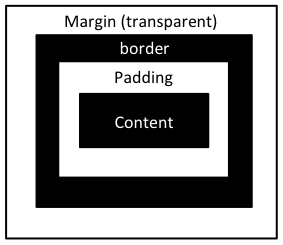

Introducing Cascading Style Sheets
==================================

A few years ago, when teaching about CSS, we would spend some time
justifying why using stylesheets was a good idea, relative to other ways
of achieving a specific layout in an HTML page. Some of the old ways are
discussed in the chapter [Content Style and
Behaviour](content-style-behaviour.md); luckily, the use of CSS is now
mainstream and well supported in browsers and web authoring tools. This
means that we can concentrate on what CSS does and how it can be used.

The core idea behind CSS is a language to define the visual properties
of documents written in HTML (they can also apply to XML documents but
for now, we won't worry about that). The visual properties that can be
controlled range from the layout of the text on the page (screen) to the
colours and fonts used to render the text. The language itself is very
simple to understand; the complexity of CSS comes in the way that rules
interact with each other in defining the whole layout of the page.


CSS Syntax
----------

A CSS stylesheet consists of one or more 'rules' which define some
visual properties of part of an HTML document. Each rule has two parts:
a selector that defines which parts of the document will be affected and
the body that lists the attributes that are to be changed. The syntax is
as follows:

```CSS
selector {
      property: value;
      property: value;
}         
```

In the simplest case, the selector is the name of an HTML tag, this
means that the rule will apply to every instance of that tag in the
document. The properties must be taken from the [defined set of CSS
properties](https://adam-marsden.co.uk/css-cheat-sheet) and the values must be legal values for the
given property. A simple example of a rule that applies to all paragraph
tags is:

```CSS
p {
      font-size: larger;
      background-color: #ccc;
      border: 1px solid black;
}         
```

The first property `font-size` defines the size of the font to be used,
we give it the value `larger` which means the font should be larger than
usual (we'll look at other possible values later). The second property
defines the background colour of the paragraph; the value here is a
hexadecimal RGB value, in this case corresponding to a shade of grey.
The final property defines a border around the paragraph with a width of
1 pixel, drawn as a solid black line. From this example you'll see that
different properties have different formats; you need to look at
examples and at [the documentation](https://adam-marsden.co.uk/css-cheat-sheet) to understand how
each one works.

Applying Stylesheets
--------------------

A collection of CSS rules is called a stylesheet and the most common
practice is to store these in a file with a .css extension which is then
linked to the HTML pages on your site. However, there are a couple of
other ways of including CSS in an HTML page so we'll go through the
different options here.

In the most common case, we would store a collection of CSS rules in a
file, say `style.css`, which will be stored on our web server and linked
to each HTML page. The link is defined by the `LINK` tag in the `HEAD`
of the HTML page:

```HTML
<html>
  <head>
    <title>Example</title>
    <link rel='stylesheet' type='text/css' href='style.css'>
...
  </head>
  <body>
...      
```

The `LINK` tag is a way of defining a relationship between this HTML
page and another resource on the web. The `rel` attribute defines what
the relationship is and the `href` attribute contains the URL of the
resource. The special relationship name `stylesheet` is interpreted by
the web browser as a link to a stylesheet, the `type` attribute defines
what kind of stylesheet it is (although CSS is really the only option).
Note that the `href` attribute is interpreted in the same way as it is
on a link within the HTML text (&lt;a href="style.css"&gt;); in this
case it is just a file name so is interpreted as a relative URL in the
same directory on the server as the page itself. More generally you
might use a site-relative URL (`/static/style.css`) or a full URL like
`http://example.org/static/style.css`.

The advantage of linking a CSS stylesheet in this way is that the same
stylesheet can be used for all pages on a site. Once the browser has
downloaded the stylesheet for the first page, it won't have to do it
again for subsequent pages. For this reason, this is by far the best way
to use CSS in a web page. However, the HTML standards provide two other
ways to include CSS in an HTML page itself and there are a small number
of circumstances where this might be a reasonable thing to do.

The first method is to include explicit CSS rules in a `STYLE` element
in the `HEAD` of the page:

```HTML
<html>
  <head>
    <title>Example</title>
    <style type='text/css'>
h1 {
   background-color: #CCFFCC;
}
p {
   font-size: smallest;
}
    </style>
  </head>
  <body>
         
```

In this example we've defined two rules to apply to headings and
paragraphs. This will have the same effect as including these rules in a
linked CSS stylesheet. The disadvantages of this approach are that the
CSS rules will only apply to this page - if they are intended to be
site-wide then they need to be repeated in each page - and that the
overall size of the HTML page is increased because of the included CSS.

This method of including CSS is justifiable in a few cases. If the CSS
is specific to one single page then there is no disadvantage in having
it in the page rather than a linked stylesheet. In fact, it will be more
efficient to put it in the page to avoid the overhead of a second HTTP
request. Having said that, it will be very uncommon for this to be the
case on most websites, since we tend to be presenting similar content on
multiple pages in a site. Another case might be where you don't have
sufficent rights on the server to upload a separate CSS file; again,
this would be a very unusual situation. The final justification for
using this style of CSS is when you are learning CSS and want to try out
different rules; it's often easier to play with a single HTML file and
in this case, performance isn't an issue.

The third and final way to include CSS styling in an HTML page is to use
the `style` attribute on an HTML tag. This attribute can contain one or
more CSS properties and values which apply only to that element.

```HTML
     <h1 style='color: yellow'>Example</h1>
```

These rules are the most specific and there are very few cases where
their use is justified. The main use is where you want to apply some
style rules but don't have control of the site-wide or in-page CSS. This
can occur in some content management systems which allow pasting of
content from Microsoft Word into web content. The formatting from Word
can be converted to HTML formatting via appropriate CSS rules but the
component that does the pasting (often an in-page editor such as
[TinyMCE](http://www.tinymce.com/index.php) or
[WYMEditor](http://www.wymeditor.org/)) can't modify the site-wide or
page stylesheets to capture these styles. In these cases you will often
see inline CSS used to style content.

### The Cascade

Since there are three ways to include CSS styling for a particular
element, there needs to be a way to decide which rule takes precedence
if more than one rule applies. This is where the 'Cascade' in Cascading
Style Sheets comes from. However, there are other sources of style
information that the cascade also deals with; for example, a particular
browser may let each user define their own stylesheet encoding their own
preferences (for example, their preferred default font). The cascade
rules define which rule actually applies to a given tag. While the
detail is a bit more complicated, the basic rules are:

Any properties in the style attribute of an element has the highest
priority
Priority is then defined by how specific the rule is based on the
selector
If two rules have equal priority, the most recent rule will apply
-   The last STYLE or LINK element in the HEAD of a page takes priority
-   Within a stylesheet, later rules override earlier ones
-   Rules supplied by the author of a page take priority over user
    defined rules
-   User defined rules take priority over those defined by the web
    browser

This priority order generally matches what you'd expect; later rules
generally take priority even if they are in different stylesheets.

There is one final mechanism that we can use to change the order of
rules, that is to mark a rule as `!important`. An important rule beats
any other rule that matches the same element in a page, even if it
appears before the second rule. If both the author of the page and the
user specifies an important rule, then the user wins. Here's an example
of an important rule:

```CSS
p {
  text-indent: 1.5em !important;
  font-size: larger;
}
    
```

In the example, the `text-indent` property is marked as important and
would override any later rule for paragraphs. It would also override any
user supplied stylesheet unless that was also marked as important.

Developing Stylesheets
----------------------

The following sections describe some of the basic uses of CSS
properties. It is by no means an exhaustive manual for CSS but is
intended to introduce the basics such that you can get started writing
stylesheets. As a reference a more complete list of CSS properties is
included [in this cheat sheet](https://adam-marsden.co.uk/css-cheat-sheet).

CSS Font Properties
-------------------

One of the first things you might try in a stylesheet is to change the
font of displayed text. There are a few properties that relate to the
font which are illustrated in this example:

```CSS
body {
  font-family: Ariel, Tahoma, sans-serif;
}
em {
  font-style: italic;
  font-weight: bold;
  font-size: larger;
}
strong {
  font-weight: bold;
  font-size: large;
}
p {
  font-size: 12pt; /* using absolute sizes is a bad idea */
}      
```

To understand the effect of the font properties it is best to look in
the [reference guide](https://adam-marsden.co.uk/css-cheat-sheet) at the different values that the
property can take. For example, the `font-weight` property can take
values like `normal, bold, bolder, lighter`, meaning that this property
is used to switch between bold and normal fonts.

The `font-family` property defines the kind of font to be used; in this
case we give some alternatives: Ariel if you have it, Tahoma if not and
if you don't have either of these then use the standard sans-serif font
configured in the browser. `font-family` is the only property that has
this kind of value with alternatives. It is designed to cope with the
common situation that the designers choice of font isn't installed on
the target computer. Best practice is to always include at least one of
the generic family names as the final alternative since these are
guaranteed to be available in some form. The generic names are: `serif`,
`sans-serif` and `fixed`. **CHECK THIS**

It is generally bad practice to use absolute sizes (eg. 12pt) for fonts
in CSS stylesheets. The reason for this is that unlike in a printed
document, these sizes don't have a fixed size on a computer screen - it
will depend on the monitor resolution and the operating system settings
of a particular device. Best practice then is to use named font sizes
like `large`, `huge`, `smaller` which are interpreted relative to the
default font size in the browser. This also means that if a user has
configured their browser to use a larger font, the sizes in the
stylesheet will be interpreted relative to this setting. Another
alternative is to use a percentage value which define the font size
relative to the default font for that element. So, if I define the font
size for `H1` headings to be `150%` then it will appear 1.5 times as big
as the default size for a top level header.

Colour and Background Properties
--------------------------------

```
em {
  color: red;
  background-color: white;
}
strong {
  color: rgb(255,0,0);
  background-color: #CCFF00;
}
body {
  background-image: url(background.gif);
  background-repeat: repeat-y; /* repeat-x, no-repeat */
  background-attachment: fixed; /* scroll */
}
     
```

CSS Formatting Model
--------------------

The CSS standard defines a way of laying out the content of a web page
according to what is called the *box model*. In this model there are two
main kinds of content in the page: inline and block. Inline content is
something like the `EM` element which surrounds a span of text inside
something like a paragraph. Block content is a paragraph, header or
table that is normally displayed as a rectangular region in the page.

Each HTML element has a default display type (there are actually a few
more than inline and block as we'll see later) but this can be changed
with the `display` property in a CSS rule. The following example would
display list items as inline content and anything marked up as `CODE` as
a block:

```CSS
li {
  display: inline;
}
code {
  display: block;
}
```

The box model applies to block content and defines a number of
properties that affect the way that it is displayed. Essentially the
whole HTML page is laid out as a series of nested blocks which by
default are displayed one below another. Each box has three properties
that define how the content is laid out relative to it's containing box
and those that are next to it; these are: margin, border and padding and
are illustrated in the diagram below.



Taking these properties from the inside out, the content is the
innermost rectangular region, this is defined by the content of the
element, for example the text of a paragraph or by an image. Around the
content, but still on the inside of the block, is the *padding* which
separates the content from the next part which is the *border*. The
padding area takes on the same background properties as the content but
the border can be coloured and styled separately: for example I can
define a solid red border or a dashed green one. The outer region is the
*margin* which is outside the block but defines the distance between the
block and any neighbouring blocks or the block that contains this one.
The margin region is not part of the block so it takes on the background
properties of the parent block.

This is all a bit complicated to understand in the abstract so some
examples might help clarify. The following example is the CSS rule used
to define the layout of this page (as I write, it might change later of
course).

```CSS
body  {
    margin: auto;
    width: 90ex;
    background-color: white;
    padding: 1ex;
    border: 1px solid black;
}
```

Note that this rule applies to the `BODY` element which is the outermost
element of the HTML page, hence it refers to the block that contains all
of the other content in the page.

The first property defines the margin as `auto` which means that the
margin will be set automatically to be given equal weight on all sides -
effectively centering the block in the browser window. The next property
defines the width of the block - without this the `auto` setting for the
margin wouldn't have the desired effect because the block would take the
width of it's parent. The width is measured in units of `ex` which is
the width of a letter 'x' **CHECK THIS**, it is sometimes useful to use
this unit as it scales with the font size used in the page.

The `background-color` property sets the colour that will appear behind
the content in the body. The `padding` is set to `1ex` meaning that
there will be a space between the text content of any paragraphs and the
border. The `border` property defines a one pixel solid black border
around the entire block. So, we should see a gap of around one character
width around the text, then a narrow black border all centered within
the browser window with an overall width of around 90 characters.

The border property can be broken down into the separate properties of
`border-width`, `border-color` and `border-style` (solid, dashed etc).

The margin, border and padding properties can also be defined for
particular edges of the box. If I want a different margin above and
below a paragraph I can use the `margin-top` and `margin-bottom`
properties to define separate values. Similarly, `padding-left`,
`border-left` or `border-width-left` define just the padding and border
(or border width) on the left side of the box. Alternatively the
individual widths can be defined in one property by specifying four
numbers for the top, right, bottom and left widths, for example:

```CSS
p {
  margin: 0px 10px 0px 10px;
  border-width: 1px 5px 1px 5px;
}
 
```

This example would define a ten pixel margin on the left and right of
paragraphs with zero pixel margins at the top and bottom and a border of
1 pixel on the top and bottom and 5 pixels on the left and right.

Selectors
---------

```
selector { property: value;}
```

-   Element name, alone or in context:

    ```
    em { color: red }
    h1 em { color: blue}
    ul li { font-size: small}
    ul ul li { font-size: x-small }
    ```

-   Element id:

    ```
    #maintitle { background-color: blue }
    ```

-   Element with class attribute:

    ```
    .relaxed { color: green }
    .angry em { font-weight: bold }
    ```


Pseudo-classes and Pseudo-elements
----------------------------------

Allow style to be applied to things that aren't marked up:

-   Anchor pseudo-classes:

    ```CSS
    A:link { color: red }       /* unvisited link */
    A:visited { color: blue }   /* visited links */
    A:active { color: lime }    /* active links */
    A.external:visited { color: blue }
      
    ```

    ```HTML
    <a class=external href="http://out.side/">external link</a> 
    ```

-   Typographical pseudo-elements:

    ```CSS
    p:first-line { font-variant: small-caps }
    p:first-letter { font-size: 200%; float: left }
    ```

Display Properties
------------------

These properties describe how the element should be displayed.

```CSS
.paragraph { display: block; margin: 10px; }
.emphasis { display: inline; font-variant: italic; }
.menuentry {
        display: list-item;
        list-style-type: square;
}
.secret { display: none; }
```

CSS Page Layout
---------------

-   Most of the above relates to the style of text on the page. What
    about page layout.
-   On most sites we need to place various page elements: headings,
    navigation, content, advertising.
-   CSS provides the required level of control using *float*,
    *width/height* and *position* properties among others.
-   Examples of CSS layouts:
    [salia.com](http://www.saila.com/usage/layouts/), [little
    boxes](http://www.thenoodleincident.com/tutorials/box_lesson/boxes.html)
-   [css/edge](http://meyerweb.com/eric/css/edge/) has more advanced CSS
    examples
-   One goal is the [liquid
    layout](http://www.maxdesign.com.au/presentation/liquid/)


Summary
-------

-   HTML encodes the content of a web page.

-   CSS encodes the appearance of the page on the screen.

-   Avoids the need for HTML to be extended to include specific display
    elements (eg. &lt;font&gt; or &lt;blink&gt;)

-   Facilitates a consistent look and feel across a web site which can
    be easily updated.

-   CSS layouts promote: semantic markup, accessibility, efficiency.


